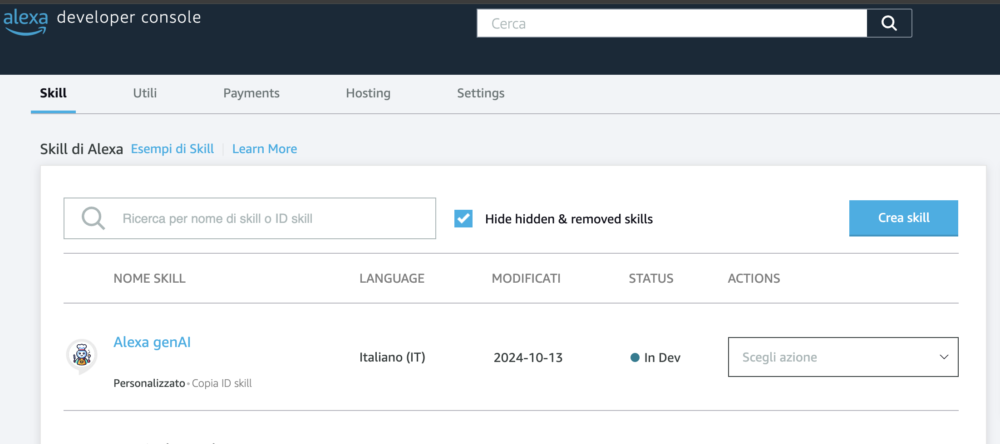
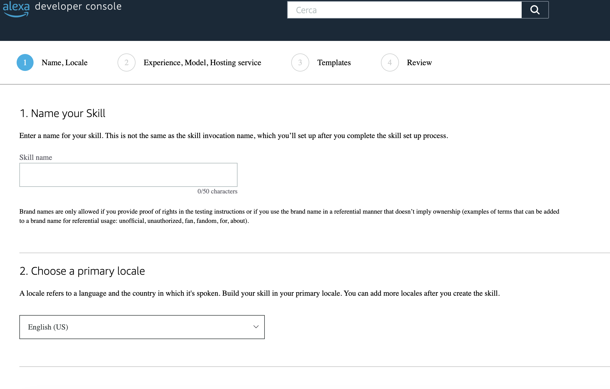
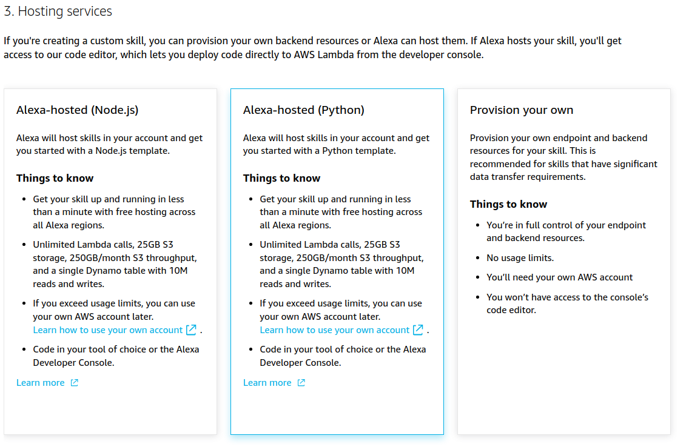
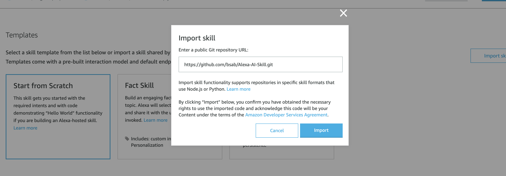
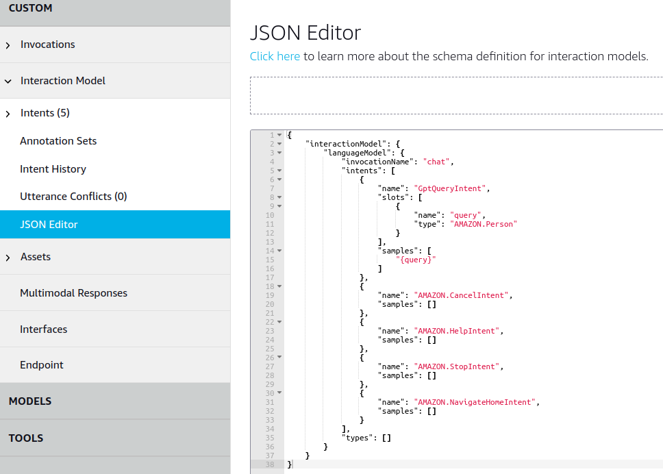
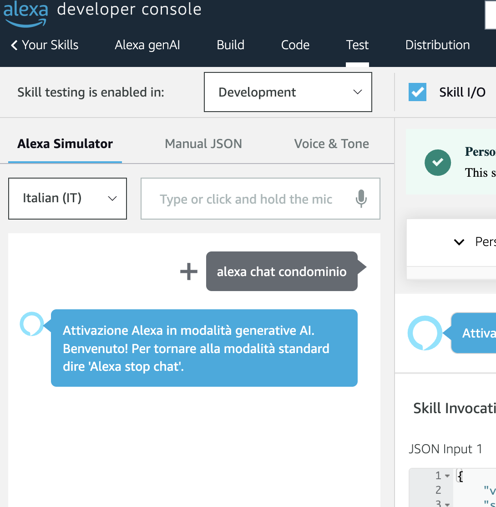

# Alexa AI: Alexa Enhancement with Azure OpenAI GPT-4  

[](https://opensource.org/licenses/MIT)

  
Welcome to the **Alexa AI ** project! This repository serves as a comprehensive guide to integrating the powerful Azure OpenAI GPT-4 API with Alexa, allowing you to significantly elevate your Alexa skill's response capabilities.  
  
## Project Overview  
By harnessing the advanced natural language understanding of GPT-4, you can transform your Alexa skill into a more engaging and intelligent assistant. This tutorial will walk you through the process of setting up and connecting the OpenAI API with Alexa, enabling dynamic and contextually rich interactions.  
  
## Key Features  
- **Seamless Integration**: Step-by-step instructions to integrate Azure OpenAI GPT-4 with your Alexa skill.  
- **Enhanced Responses**: Enable Alexa to generate more natural, informative, and context-aware responses.  
- **User-Friendly Guide**: Detailed documentation and code samples to assist developers of all levels.  

  
<div align="center">
  
</div>

## Prerequisites

- An [Amazon Developer account](https://developer.amazon.com/)
- An [OpenAI API key](https://platform.openai.com/api-keys)

## Step-by-step tutorial

### 1. <span name=item-1></span>
Log in to your Amazon Developer account and navigate to the [Alexa Developer Console](https://developer.amazon.com/alexa/console/ask).

### 2.
Click on "Create Skill" and name the skill "Chat". Choose the primary locale according to your language.



### 3.
Choose "Other" and "Custom" for the model.


### 4.
Choose "Alexa-hosted (Python)" for the backend resources.



### 5.
You now have two options:
- Click on "Import Skill", paste the link of this repository (https://github.com/bsab/Alexa-AI-Skill.git) and click on "Import".


Or if you want to create the skill manually
- Select "Start from Scratch" and click on "Create Skill"


### 6.
In the "Build" section, navigate to the "JSON Editor" tab.

### 7.
If you have directly imported the skill from this repository, just change the "invocationName" to "chat" or another preferred word for activation and proceed to [step 12](#12).

However, if you chose to manually create the skill, replace the existing JSON content with the [provided JSON content](json_editor.json):

```json
{
    "interactionModel": {
        "languageModel": {
            "invocationName": "chat",
            "intents": [
                {
                    "name": "GptQueryIntent",
                    "slots": [
                        {
                            "name": "query",
                            "type": "AMAZON.Person"
                        }
                    ],
                    "samples": [
                        "{query}"
                    ]
                },
                {
                    "name": "AMAZON.CancelIntent",
                    "samples": []
                },
                {
                    "name": "AMAZON.HelpIntent",
                    "samples": []
                },
                {
                    "name": "AMAZON.StopIntent",
                    "samples": []
                },
                {
                    "name": "AMAZON.NavigateHomeIntent",
                    "samples": []
                }
            ],
            "types": []
        }
    }
}
```



### 8.
Save the model and click on "Build Model".

### 9.
Go to "Code" section and add "openai" to requirements.txt. Your requirements.txt should look like this:

```txt
ask-sdk-core==1.11.0
boto3==1.9.216
requests>=2.20.0
```

### 10.
Create an OpenAI API key on the [API keys page](https://platform.openai.com/api-keys) by clicking "+ Create new secret key".

### 11.
Replace your lambda_functions.py file with the [provided lambda_function.py](lambda/lambda_function.py).

```python
from ask_sdk_core.dispatch_components import AbstractExceptionHandler, AbstractRequestHandler
from ask_sdk_core.skill_builder import SkillBuilder
from ask_sdk_core.handler_input import HandlerInput
from ask_sdk_model import Response
import ask_sdk_core.utils as ask_utils
import requests
import logging
import json

from utils import load_system_prompt  # Importa la funzione dal file utils

# Carica il system prompt dal file
system_prompt_file_path = "path/to/your/system_prompt.txt"
system_prompt = load_system_prompt(system_prompt_file_path)

api_key = "YOUR_API_KEY"
api_endpoint =" YOUR_API_ENDPOINT"

logger = logging.getLogger(__name__)
logger.setLevel(logging.INFO)


class LaunchRequestHandler(AbstractRequestHandler):
    def can_handle(self, handler_input):
        return ask_utils.is_request_type("LaunchRequest")(handler_input)

    def handle(self, handler_input):
        speak_output = "Alexa gen AI mode activated"
        session_attr = handler_input.attributes_manager.session_attributes
        session_attr["chat_history"] = []
        return handler_input.response_builder.speak(speak_output).ask(speak_output).response


class GptQueryIntentHandler(AbstractRequestHandler):
    def can_handle(self, handler_input):
        return ask_utils.is_intent_name("GptQueryIntent")(handler_input)

    def handle(self, handler_input):
        query = handler_input.request_envelope.request.intent.slots["query"].value
        session_attr = handler_input.attributes_manager.session_attributes
        if "chat_history" not in session_attr:
            session_attr["chat_history"] = []
        response = generate_gpt_response(session_attr["chat_history"], query)
        session_attr["chat_history"].append((query, response))
        return handler_input.response_builder.speak(response).ask("Any other questions?").response


class CancelOrStopIntentHandler(AbstractRequestHandler):
    def can_handle(self, handler_input):
        return (ask_utils.is_intent_name("AMAZON.CancelIntent")(handler_input) or
                ask_utils.is_intent_name("AMAZON.StopIntent")(handler_input))

    def handle(self, handler_input):
        speak_output = "Leaving Alexa Gen AI mode"
        return handler_input.response_builder.speak(speak_output).response


class CatchAllExceptionHandler(AbstractExceptionHandler):
    def can_handle(self, handler_input, exception):
        return True

    def handle(self, handler_input, exception):
        logger.error(exception, exc_info=True)
        speak_output = "Sorry, I had trouble doing what you asked. Please try again."
        return handler_input.response_builder.speak(speak_output).ask(speak_output).response


def generate_gpt_response(chat_history, new_question):
    headers = {"Content-Type": "application/json", "api-key": api_key}
    url = api_endpoint
    messages = [{"role": "system", "content": system_prompt}]
    for question, answer in chat_history[-10:]:
        messages.append({"role": "user", "content": question})
        messages.append({"role": "assistant", "content": answer})
    messages.append({"role": "user", "content": new_question})
    data = {"messages": messages, "temperature": 0.7, "top_p": 0.95, "max_tokens": 300}
    try:
        response = requests.post(url, headers=headers, json=data)
        response_data = response.json()
        if response.ok:
            return response_data['choices'][0]['message']['content']
        else:
            return f"Error {response.status_code}: {response_data['error']['message']}"
    except Exception as e:
        return f"Error generating response: {str(e)}"


sb = SkillBuilder()
sb.add_request_handler(LaunchRequestHandler())
sb.add_request_handler(GptQueryIntentHandler())
sb.add_request_handler(CancelOrStopIntentHandler())
sb.add_exception_handler(CatchAllExceptionHandler())

lambda_handler = sb.lambda_handler()
```

### 12.
Save and deploy. Go to "Test" section and enable "Skill testing" in "Development".


### 13.
You are now ready to use your Alexa in ChatGPT mode. You should see results like this:



## Contributing  
We welcome contributions! If you have ideas for improvements or new features, please submit a pull request or open an issue.  
